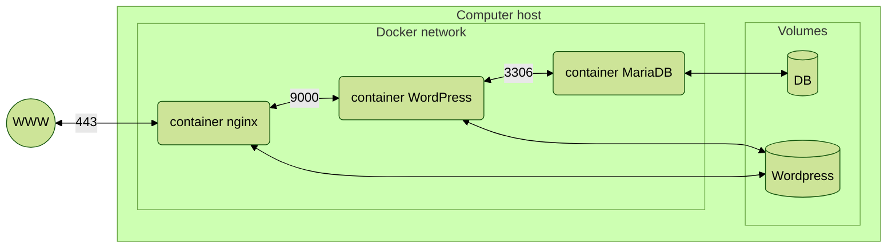

*This project has been created as part of the 42 curriculum by abarzila*

# Project Inception

## Description
Inception is a 42 school a system administration related project to make our first steps in the world of docker networks. 
We had to virtualize three docker images and connect them to one another in order to have a functionnal Wordpress website, with a mariaDB data base, via an nginx server proxy.

### Elements of the project



### Project description
#### Virtual machines VS docker
Virtual machines and docker do look alike, as they both simulate an environment. But they are inherently different. 
Virtual machines (VM) are virtual environment that **access the kernel through the hypervisor**, when container access directly to the kernel.  
Most of the times, a VM will have an OS, it will simulate a CPU, the RAM, and everything in a machine, making the images heavy, easly many Gyga bytes.  
In the case of the container, it only contains an app with no OS, only the bare minimum with no interface whatsoever. Also in a network, the containers optimize by loading the libraries once for everyone. A container image is usually weighted in Mega bytes.
In a nutshell, **dockers are optimized and lighter VM, with no intermediate to the kernel**. The biggest con is that it is a younger technology (Docker is from 2013) which can have security or system breachs. 

##### Container or docker ?
Docker is a platform displaying containers and helping build images architectures.  
Each container contain an isolated app, and docker automate its deployment and, if needed, creates a special network architecture.  
The main function of container is to solve the compatibilty problems that can occur when an app runs from one machine to another. By building an app in a isolated environment, you then only have to give the environment with the app to make sure it works.  
Also by being isolated, the containers have less chance of being corrupted by the host.     

#### Secrets VS Environment variables
Environment variables keep existing in the image of the docker and can be accessed when we execute the container in a terminal interface. They are useful but setting passwords or such as environment variable can be a security breach as they will still be accessible after the build.
To communicate compromised informations to the docker compose or dockerfile, it is a way better practice to use secrets as the data is encrypted and no trace is left in the final image.   

#### Docker network VS host network
Both networks are networking modes for containers.  
The docker network are isolated from the machine. In a docker network dockers can communicate, and docker networks can communicate to other docker networks, but can communicate with the host. Whereas host network allows the containers to use the host machine's stack, without isolation.  
Host network has better performance, as it is connected to the machine directly, but docker network is more secure, as there is no communication with the machine.

#### Docker volumes VS bind mounts
Both docker volumes and bind mount has the same function. They both are a directory or a file that will stock the docker components in order to persist when the docker is down.    
The bind mount is when a sym link is created between an already existing directory on the host machine and the container. The bind mount need an absolute path on the host machine then.    
The docker volume is a directory created by Docker, stored on the host machine. 
Bind mount tends to be obsolete as it can not be interacted with using APIs, and the fact that it needs an absolute path is not as practical as a specified directory created by docker, using always the same docker path and using also directly the name of the volume. It's cleaner.    


## Instructions
Git clone this project onto your computer host. You will need to have sudo, since some makefile targets use `rm -rf` commands.  
Add to your cloned directory a `.env` file. You will need all the variables given in the `.env_example_to_fill.txt` file.
Go in your cloned directory, then to build your docker network and wordpress website, do `make up`. To down your containers, you can do `make down`. At any time you can do `make` or `make help` to see all the available targets.

```
git clone <this project> <directory-name>
cd <directory-name>
touch .env
<fill your .env file>
make up
make down //when you are finished
```
That's it ! You now have a running Wordpress page ! If you want to know more about it, you can go to the `DEV_DOC.md` file, or `USER_DOC.md` file, depending on your needs.

## Use of AI
In this project, I used AI when I had an unexpected behavior in my code, not knowing the origin, especially when they were no visible error or fail.  
Very quickly, the use of AI became counterproductive as it doesn't really 'think' as a whole. Asking help to my school mates turned out way more effective.

## Project diagram
### Structure of the project
```mermaid
```
```
README.md
USER_DOC.md
DEV_DOC.md
Makefile
srcs/
├─ docker-compose.yml
├─ .env
├─ requirements/
│  ├─ mariadb/
│  │  ├─ dockerfile
│  │  ├─ init.sh
│  ├─ wordpress/
│  │  ├─ dockerfile
│  │  ├─ init.sh
│  ├─ nginx/
│  │  ├─ dockerfile
│  │  ├─ nginx.conf
```

## Resources
- [make a yml file](https://github.com/Tutors42Lyon/Github-Actions)
- [make a dockerfile](https://docs.docker.com/get-started/docker-concepts/building-images/writing-a-dockerfile/)
- [VM VS container](https://www.youtube.com/watch?v=aN4PCILrbBg)
- [what is docker](https://www.youtube.com/watch?v=mspEJzb8LC4)
- [what is docker](https://fr.wikipedia.org/wiki/Docker_(logiciel))
- [write a docker-compose.yml](https://www.youtube.com/watch?v=DM65_JyGxCo)
- [understanding Inception step by step](https://tuto.grademe.fr/inception/)
- [debian's versions](https://www.debian.org/releases/index.fr.html)
- [connecting MariaDB to a server](https://mariadb.com/docs/server/server-usage/connecting/mariadb-connecting-guide-1)
- [what is nginx](https://www.f5.com/glossary/nginx)
- [docker compose documentation](https://docs.docker.com/reference/compose-file/)
- [explore database](https://www.softwaretestinghelp.com/use-mysql-from-command-line/)
- [What is php-fpm](https://www.plesk.com/blog/guides/php-fpm-the-future-of-php-handling/)
- [What is PID 1 and how to do a proper init ](https://denibertovic.com/posts/containers-and-signal-handling-why-you-need-to-care-about-pid-1/)
- [What are docker secrets](https://www.wiz.io/academy/container-security/docker-secrets)
- [Docker network VS host network](https://thisvsthat.io/docker-network-vs-host-network)
- [Docker volume VS bind mount](https://www.geeksforgeeks.org/devops/docker-volume-vs-bind-mount/)
- [docker networks](https://geeksforgeeks.org/devops/basics-of-docker-networking/)